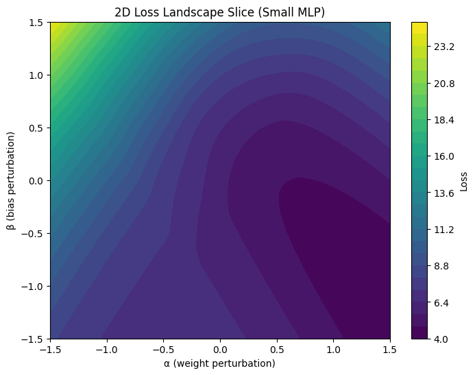
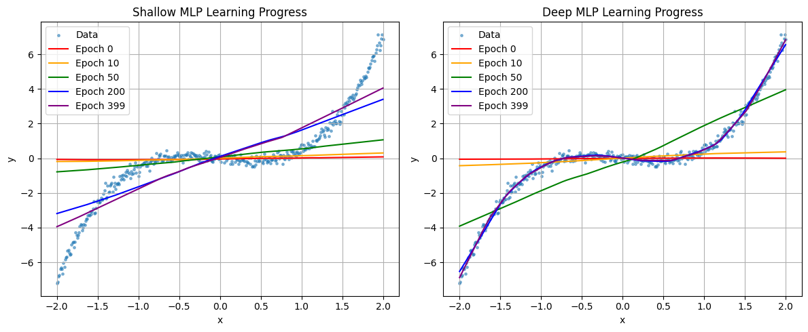

# Hi, I am Ritwika. Welcome to my research portfolio. 

## 👩‍🔬 Applied Scientist • Neural Networks for Routing • Mechanistic Interpretability

I love visualizing how neural networks **think**, **learn**, and **develop structure**.

Here are some examples of the visuals I create 👇

## 🔬 Research

### 📄 MILP-Transformer: A Neural Surrogate MILP Solver with Constraint Experts  
**Status:** Preprint (ICML 2026 submission)  
[📘 PDF](https://raw.githubusercontent.com/ritwikareddykancharla/neural-milp-surrogate/main/paper/main.pdf) ·  
[💻 Code](https://github.com/ritwikareddykancharla/neural-milp-surrogate)

A transformer-based neural surrogate for mixed-integer linear programs (MILPs), featuring:
- Constraint-specialized Mixture-of-Experts  
- Soft binary relaxations  
- Latent refinement loops  
- MILP-aware attention using primal–dual signals  
Achieves near-MILP quality with 50–100× faster inference on 50–200 node routing problems.

---

### 📄 Diffusion Priors for Routing Optimization (Working Title)  
**Status:** Draft manuscript · ICML 2026 submission  
[💻 Code (WIP)](https://github.com/ritwikareddykancharla/routing-diffusion)

Explores diffusion-based generative priors for producing feasible routing structures, enabling:
- Structure-aware denoising for binary routing decisions  
- Latent flow regularization  
- Multi-sample proposal generation for surrogate MILPs  

---

### 📄 Routing World Models for Multi-step Planning  
**Status:** Draft manuscript · ICML 2026 submission  
[💻 Code (WIP)](https://github.com/ritwikareddykancharla/routing-world-model)

A MuZero-style latent dynamics model for forecasting:
- congestion  
- future constraints  
- flow redistribution  
- multi-hop rollout effects  

Enables long-horizon planning on Amazon-style routing networks.

---

### 📚 RoutingAGI: Unified Architecture for Routing Optimization  
**Status:** Technical Monograph (100+ pages, in progress)  
A consolidated book-style document covering:
- MILP surrogates  
- routing diffusion  
- world models  
- constraint circuits  
- large-scale experiments  
- foundation models for optimization  

---

## 🔬 Visualization Examples

### 🧭 2D Loss Landscape  

---

### 🧠 MLP Training Animation  

---

### 🌱 Shallow vs Deep Model Training Curves  

---

## 🚚 What I'm Working On — **RoutingAGI**

I'm building **RoutingAGI**, a spatial-transformer + SSM architecture designed for  
*Amazon-scale routing, spatial reasoning, and interpretable decision-making.*

RoutingAGI explores:

- 🗺️ Graph-based spatial encoding  
- 🌀 SSM/Mamba-style route planning  
- 🧩 Constraint-aware MoE (capacity, SLAs, time windows)  
- 📦 Multi-agent route generation  
- 🔍 Full mechanistic transparency (attention circuits, activations, geometry)

A routing model that not only performs…  
but **explains itself**.

---
